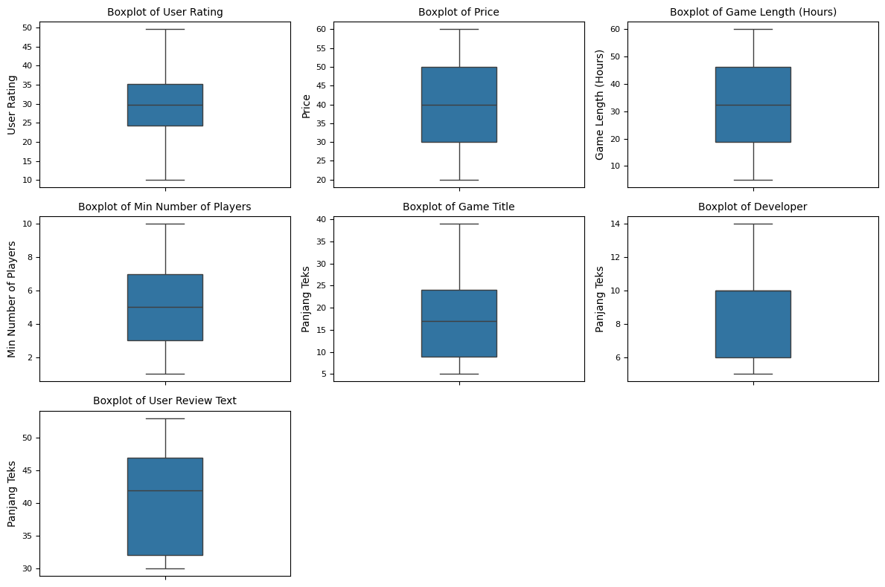
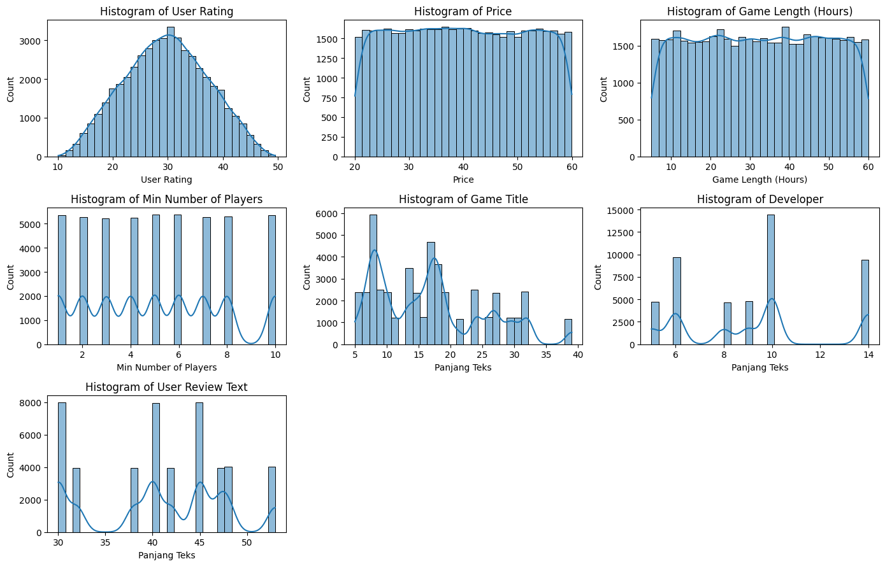
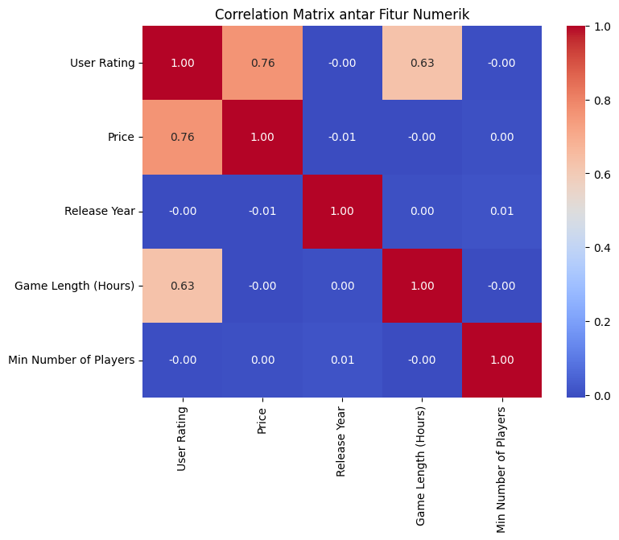
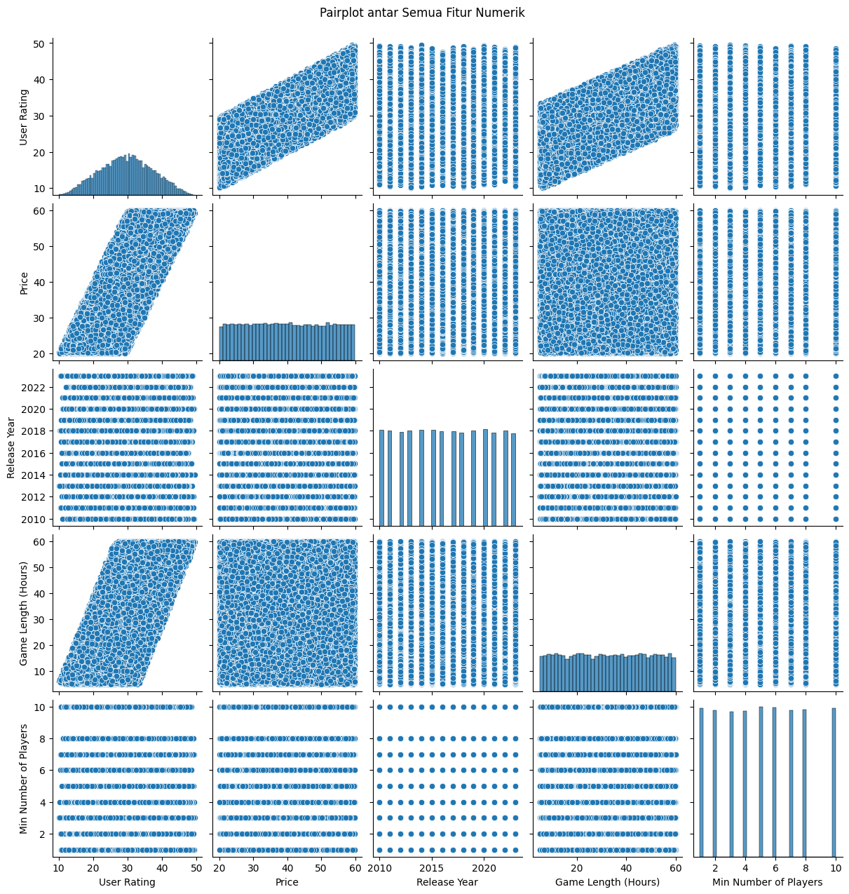
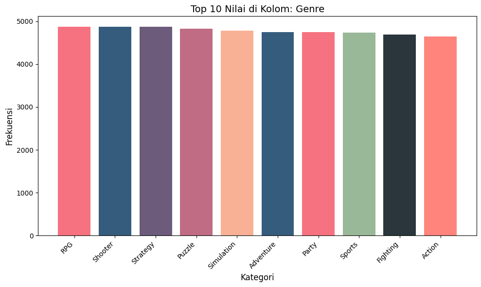
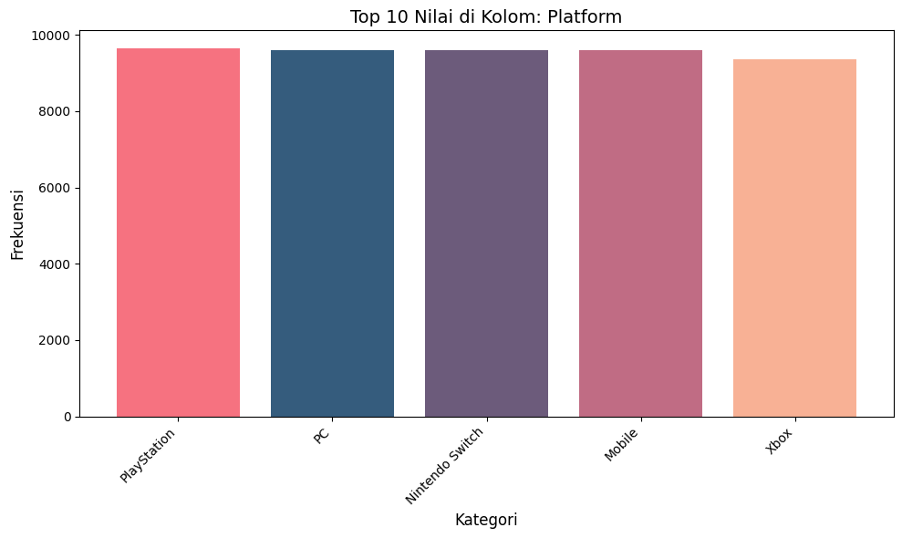
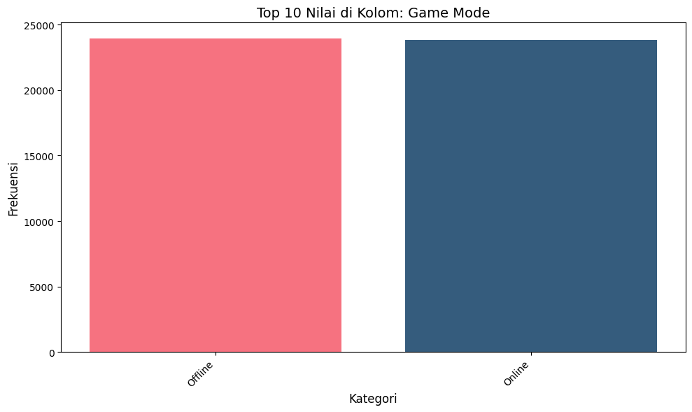
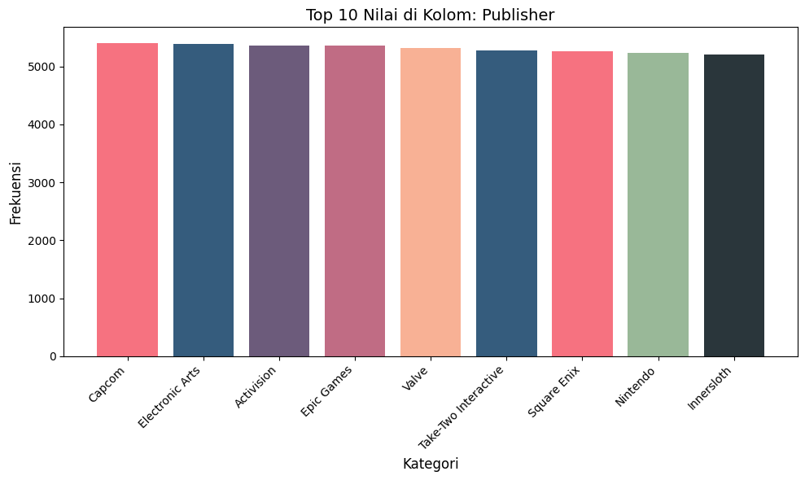
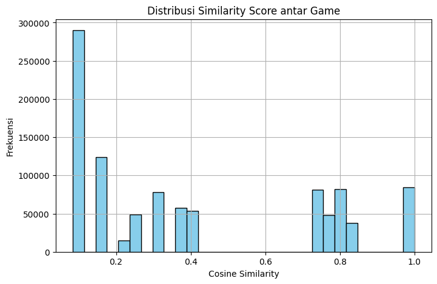

# Laporan Proyek Machine Learning - M. Fakhrizal Nur Athoilah
---

# Project Overview
---
## Latar Belakang
Industri video game telah mengalami pertumbuhan eksponensial dalam dua dekade terakhir, baik dari segi jumlah pengguna, genre permainan, hingga volume konten yang tersedia. Menurut laporan dari Statista, pendapatan pasar game global diperkirakan mencapai lebih dari USD 180 miliar pada tahun 2021 dan terus meningkat setiap tahunnya [1](https://www.statista.com/statistics/292056/video-game-market-value-worldwide/). Di tengah banyaknya pilihan yang tersedia, pengguna kerap mengalami kesulitan dalam menemukan permainan yang sesuai dengan preferensi mereka, terutama ketika mereka tidak memiliki waktu atau informasi cukup untuk mengevaluasi semua opsi yang tersedia.

Salah satu solusi yang terbukti efektif dalam membantu pengguna adalah sistem rekomendasi. Sistem ini dapat memberikan saran permainan yang relevan dan dipersonalisasi berdasarkan berbagai parameter seperti genre, rating pengguna, platform, atau ulasan. Dalam konteks ini, sistem rekomendasi berbasis konten (content-based filtering) menjadi pendekatan yang sangat berguna karena dapat mengandalkan informasi deskriptif dari masing-masing permainan.

Permasalahan utama yang ingin diselesaikan dalam proyek ini adalah bagaimana menyajikan rekomendasi permainan yang relevan berdasarkan karakteristik game yang tersedia di dalam dataset. Pengguna sering kali mencari game baru yang “mirip” dengan game yang mereka sukai, baik dari segi genre, popularitas, rating, maupun ulasan pengguna. Tanpa sistem yang terstruktur, pencarian tersebut menjadi tidak efisien dan tidak akurat.

Oleh karena itu, perlu dikembangkan sistem rekomendasi otomatis yang dapat membantu pengguna dalam memilih game secara lebih cepat dan sesuai dengan preferensi mereka. Sistem ini dapat pula diimplementasikan di platform distribusi digital seperti Steam atau PlayStation Store, yang memiliki ribuan judul game dan basis pengguna aktif yang besar.

Proyek ini bertujuan untuk membangun sistem rekomendasi permainan video menggunakan pendekatan content-based filtering, yang memanfaatkan fitur-fitur deskriptif dari dataset seperti genre, rating pengguna, dan ulasan. Sistem ini diharapkan mampu memberikan rekomendasi permainan yang relevan berdasarkan kemiripan konten antar game.

Dataset yang digunakan adalah Video Game Reviews and Ratings yang tersedia di Kaggle [2]. Dataset ini berisi informasi mengenai berbagai video game, termasuk nama game, platform, genre, skor dari pengguna dan kritikus, serta data lainnya yang dapat digunakan untuk membangun sistem rekomendasi.

**Referensi**
[1] Statista Research Department. (2021). Video game industry revenue worldwide 2010-2021. [Online]. Available: https://www.statista.com/statistics/292056/video-game-market-value-worldwide/

[2] Jahnavi Paliwal. (2023). Video Game Reviews and Ratings Dataset. [Online]. Available: https://www.kaggle.com/datasets/jahnavipaliwal/video-game-reviews-and-ratings

[3] Ricci, F., Rokach, L., & Shapira, B. (2015). Recommender Systems Handbook. Springer.
[4] Jannach, D., Adomavicius, G., & Tuzhilin, A. (2021). "Recommender Systems: Challenges, Insights and Research Opportunities," ACM Transactions on Intelligent Systems and Technology (TIST), vol. 12, no. 1.

---
# Business Understanding

## a. Problem Statement
- Pengguna kesulitan menemukan game yang sesuai dengan preferensi pribadi mereka di tengah banyaknya pilihan yang tersedia.
  Banyak pemain memilih game hanya berdasarkan popularitas atau rating tertinggi, bukan berdasarkan kesesuaian dengan preferensi pribadi, seperti genre favorit, platform, atau gaya permainan. Hal ini menyebabkan pengalaman bermain yang kurang memuaskan dan rendahnya retensi pengguna pada platform distribusi digital.
- Platform distribusi game belum memiliki sistem rekomendasi yang cukup personal dan kontekstual.
  Sistem rekomendasi yang bersifat generik cenderung memberikan hasil yang sama untuk semua pengguna, sehingga kurang relevan dan tidak mampu menggambarkan keragaman minat individu.
- Kurangnya pemanfaatan data ulasan dan skor game secara efektif untuk mendukung keputusan pengguna.
  Banyak informasi penting yang tersedia, seperti skor dari pengguna dan kritikus, genre, dan platform, tetapi belum digunakan secara optimal untuk menyusun saran permainan yang akurat dan berbasis data.

## b. Goals
- Membangun sistem rekomendasi permainan video yang mampu menyarankan game berdasarkan preferensi pengguna.
  Sistem ini diharapkan mampu mengidentifikasi permainan yang mirip dengan game yang disukai pengguna sebelumnya, berdasarkan fitur seperti genre dan ulasan, sehingga meningkatkan kepuasan dan keterlibatan pengguna.
- Meningkatkan personalisasi rekomendasi di platform distribusi game.
  Dengan pendekatan yang lebih kontekstual dan individual, pengguna akan menerima saran permainan yang lebih relevan dan tidak generik.
- Mengoptimalkan penggunaan data ulasan dan skor untuk mendukung pengambilan keputusan pengguna.
  Sistem akan mengintegrasikan data kuantitatif (skor pengguna dan kritikus) dan data kategorikal (genre, platform) dalam proses rekomendasi, sehingga saran permainan bersifat informatif dan berbasis bukti.

## c. Solution Statement
- Sistem rekomendasi akan menganalisis fitur tekstual seperti genre atau kombinasi deskripsi game.
- TF-IDF (Term Frequency-Inverse Document Frequency) digunakan untuk mengubah teks menjadi representasi numerik yang mencerminkan pentingnya kata-kata.
- Cosine similarity menghitung kemiripan antar game untuk memberikan saran yang relevan.

---

# Data Understanding
Dataset yang digunakan memiliki keterangan sebagai berikut:

| Jenis      | Keterangan                                                                 |
|------------|------------------------------------------------------------------------------|
| Title      | Video Game Reviews and Ratings                                                |
| Source     | [Kaggle](https://www.kaggle.com/datasets/jahnavipaliwal/video-game-reviews-and-ratings) |
| License    | [Apache License, Version 2.0](https://www.apache.org/licenses/LICENSE-2.0)              |
| Visibility | Public                                                                      |
| Tags       | Game, Video Game                                                            |
| Usability  | 10.00                                                                       |

Dataset ini memiliki variable-variable sebagai berikut:

- `Game Title`: Nama atau judul dari video game.
- `User Rating`: Penilaian yang diberikan oleh pengguna terhadap game, biasanya dalam skala tertentu (misalnya 1–10).
- `Age Group Targeted`: Kelompok usia yang menjadi target utama game ini, seperti "Kids", "Teens", atau "Adults".
- `Price`: Harga jual game dalam satuan.
- `Platform`: Platform di mana game tersedia, seperti PC, PlayStation, Xbox, atau Switch.
- `Requires Special Device`: Menunjukkan apakah game memerlukan perangkat khusus seperti VR headset atau motion controller.
- `Developer`: Nama studio atau pengembang game.
- `Publisher`: Nama perusahaan yang merilis atau mendistribusikan game.
- `Release Year`: Tahun rilis dari game tersebut.
- `Genre`: Genre atau jenis permainan, seperti Action, RPG, Puzzle, atau Sports.
- `Multiplayer`: Menunjukkan apakah game mendukung mode multipemain.
- `Game Length (Hours)`: Durasi rata-rata permainan dalam jam.
- `Graphics Quality`: Penilaian terhadap kualitas grafis game, bisa dalam skala tertentu atau kategori seperti Low, Medium, High.
- `Soundtrack Quality`: Penilaian terhadap kualitas musik atau efek suara dalam game.
- `Story Quality`: Penilaian terhadap kualitas cerita atau alur narasi game.
- `User Review Text`:	Ulasan atau komentar pengguna tentang game tersebut.
- `Game Mode`: Mode permainan yang tersedia, seperti Single Player, Multiplayer, atau Co-op.
- `Min Number of Players`: Jumlah minimum pemain yang dibutuhkan untuk memainkan game, terutama untuk game multipemain atau co-op.

Jumlah data pada dataset ini adalah:
|Jumlah Baris |Jumlah Kolom|
|-------------|------------|
|47774        |18          |


### a. Deskripsi Variabel
Hasil di atas bisa kita lihat terdapat:
- Total 18 kolom.
- Mayoritas kolom memiliki tipe data `object`.
- 13 kolom bertipe `object` (string/kategori) -> Berisi teks atau nilai kategorikal seperti nama game, genre, platform, review, kualitas, dan lainnya.
- 3 kolom bertipe `float64` -> Data numerik dengan desimal: User Rating, Price, Game Length (Hours).
- 2 kolom bertipe `int64` -> Bilangan bulat: Release Year, Min Number of Players.

### b. Kondisi Data
- Dattaset ini tidak memiliki nilai kosong sama sekali.
- Dataset ini juga tidak memiliki nilai duplikat.
- Dataset ini juga tidak memiliki outlier.

### c. Univariate Analysis
#### a)Visualisasi distribusi boxplot

Berikut ini penjelasan dari masing-masing box plot:

**1. Boxplot of User Rating**
- Menampilkan distribusi nilai rating dari pengguna untuk masing-masing game.
- Median sekitar 32–35, menunjukkan rating rata-rata pengguna ada di rentang tersebut.
- Terlihat adanya outlier di bawah 15 dan di atas 45, yang menunjukkan bahwa sebagian kecil game memiliki rating sangat rendah atau sangat tinggi.
- Sebaran data cukup merata namun condong ke tengah, mencerminkan variasi penilaian pengguna.

**2. Boxplot of Price**
- Menampilkan distribusi harga dari game.
- Median harga berada di sekitar 40–45.
- Terdapat outlier di bawah 25 dan di atas 55–60, menunjukkan adanya game yang sangat murah maupun sangat mahal.
- Distribusinya cukup lebar, mencerminkan adanya perbedaan harga yang signifikan antar game.

**3. Boxplot of Game Length (Hours)**
- Menampilkan sebaran durasi gameplay atau lamanya game dimainkan.
- Median berada di sekitar 30 jam, menandakan sebagian besar game berdurasi cukup panjang.
- Terdapat outlier di kedua sisi, menunjukkan beberapa game yang sangat singkat maupun sangat panjang.
- Rentang interkuartil yang lebar menunjukkan variasi yang besar dalam durasi game.

**4. Boxplot of Min Number of Players**
- Menampilkan jumlah minimal pemain yang dibutuhkan untuk memainkan game.
- Median berada di 5–6 pemain, artinya kebanyakan game dirancang untuk dimainkan dalam grup.
- Terlihat outlier di bawah 2 dan di atas 8, yang menunjukkan adanya game yang bisa dimainkan solo maupun secara besar-besaran.
- Variasi antar game cukup jelas, menunjukkan beragam gaya bermain yang ditawarkan.

**5. Boxplot of Game Title (Panjang Teks)**
- Mengukur panjang karakter nama game (bukan isi game-nya).
-Median panjang judul game berada di sekitar 18–20 karakter.
- Beberapa game memiliki judul sangat pendek (~ 5 karakter), dan beberapa cukup panjang (~ 40 karakter).
- Sebagian besar judul game memiliki panjang yang cukup moderat, menunjukkan konsistensi dalam penamaan.

**6. Boxplot of Developer (Panjang Teks)**
- Menampilkan panjang teks nama developer.
- Median berada di kisaran 8–9 karakter.
- Outlier menunjukkan adanya developer dengan nama sangat pendek (~5) dan sangat panjang (~14).
- Panjang nama developer relatif lebih konsisten dibandingkan panjang judul game.

**7. Boxplot of User Review Text (Panjang Teks)**
- Menggambarkan panjang teks ulasan dari pengguna dalam karakter.
- Median ulasan berada di kisaran 42–45 karakter, dengan variasi mulai dari 30 hingga 55+ karakter.
- Ini menunjukkan bahwa sebagian besar pengguna menulis ulasan singkat, kemungkinan berupa satu atau dua kalimat saja.
- Tidak ada outlier yang ekstrem, mencerminkan keseragaman dalam panjang review.

#### b) Visualisasi distribusi histogram

Berikut adalah penjelasan dari per subplot:

**1. User Rating**
- Histogram menunjukkan pola menyerupai kurva normal, dengan mayoritas rating berkumpul di sekitar nilai 30.
- Nilai rating tersebar dari sekitar 10 hingga 50, dan tidak ada dominasi pada skor rendah atau tinggi.

**2. Price**
- Nilai harga tersebar cukup merata di seluruh rentang, dari sekitar 20 hingga 60.
- Tidak terlihat adanya konsentrasi pada harga tertentu, menunjukkan game berasal dari berbagai segmen harga.

**3. Game Length (Hours)**
- Panjang waktu bermain game tersebar di kisaran 0 hingga 60 jam, dengan jumlah game relatif seragam di berbagai durasi.
- Terdapat sedikit konsentrasi pada jam-jam tertentu, namun secara umum cukup bervariasi.

**4. Min Number of Players**
- Nilai minimum pemain cenderung diskrit dan merata dari 1 hingga 10.
- Tidak ada angka jumlah pemain minimum yang secara mencolok mendominasi.

**5. Game Title (Panjang Teks)**
- Panjang karakter judul game bervariasi dari sekitar 5 hingga 40 karakter.
- Beberapa puncak frekuensi muncul di sekitar panjang 10, 15, dan 25 karakter.

**6. Developer (Panjang Teks)**
- Nama pengembang memiliki panjang teks yang tersebar dari sekitar 5 hingga 14 karakter.
- Terlihat puncak pada panjang tertentu, menandakan banyak developer menggunakan nama dengan panjang khas.

**7. User Review Text (Panjang Teks)**
- Panjang ulasan pengguna berkisar antara 30 hingga 55 karakter.
- Beberapa panjang teks muncul lebih sering, menunjukkan kecenderungan pengguna menulis ulasan dengan panjang tertentu.

### e. Multivariate Analysis
#### a)  Matriks korelasi.

Berikut penjelasan singkat dari korelasi matriks:

**1. User Rating**
- Memiliki korelasi positif yang kuat dengan Price (0.76), menunjukkan bahwa game dengan rating tinggi cenderung memiliki harga yang lebih tinggi.
- Juga berkorelasi positif dengan Game Length (Hours) (0.63), yang berarti game dengan durasi lebih panjang cenderung mendapat rating lebih baik.
- Tidak menunjukkan hubungan berarti dengan Release Year atau Min Number of Players.

**2. Price**
- Memiliki korelasi positif yang kuat dengan User Rating (0.76), menandakan bahwa game yang lebih mahal umumnya memiliki rating lebih tinggi.
- Tidak memiliki hubungan signifikan dengan fitur lainnya seperti Release Year, Game Length (Hours), atau Min Number of Players.

**3. Release Year**
- Tidak memiliki korelasi yang berarti dengan fitur lainnya.
- Nilai korelasi sangat mendekati nol, menunjukkan bahwa tahun rilis tidak berkaitan kuat dengan rating, harga, durasi main, maupun jumlah pemain minimum.

**4. Game Length (Hours)**
- Berkorelasi positif dengan User Rating (0.63), artinya game yang berdurasi lebih panjang cenderung mendapatkan penilaian lebih baik dari pengguna.
- Korelasinya dengan fitur lain sangat lemah atau mendekati nol.

**5. Min Number of Players**
- Tidak menunjukkan hubungan korelasi yang signifikan dengan fitur numerik lainnya.
- Nilai korelasinya mendekati nol di semua pasangan fitur.

#### b) Pairplot

Berikut adalah penjelasan Scatter Plot antar Variabel:

**1. User Rating vs Price**
- Scatter plot menunjukkan pola linier positif yang kuat, mengindikasikan bahwa semakin tinggi rating sebuah game, semakin mahal pula harganya.
- Ini mendukung hasil korelasi sebelumnya (r = 0.76).

**2. User Rating vs Game Length (Hours)**
- Terlihat pola linier positif: game dengan durasi bermain lebih lama cenderung memiliki rating lebih tinggi.
- Sebagian besar titik membentuk diagonal yang naik, mendukung korelasi positif sebelumnya (r = 0.63).

**3. User Rating vs Release Year / Min Number of Players**
- Titik-titik terlihat tersebar tanpa pola jelas, menandakan tidak ada korelasi signifikan.
- Ini sesuai dengan nilai korelasi mendekati nol pada heatmap.

**4. Price vs Game Length (Hours)**
- Tidak tampak pola yang konsisten atau jelas.
- Titik tersebar secara acak, mendukung asumsi tidak ada hubungan kuat antara harga game dan durasi mainnya.

**5. Release Year vs Fitur Lain**
- Sebagian besar plot terhadap Release Year menunjukkan sebaran horizontal atau vertikal garis-garis.
- Ini karena Release Year bersifat diskrit dan terbatas (sekitar 2010–2022), sehingga tidak menunjukkan pola korelatif berarti terhadap fitur lainnya.

**6. Min Number of Players vs Fitur Lain**
- Scatter plot tampak tersegmentasi dalam barisan vertikal, karena data bersifat diskrit/kategori numerik (1–10 pemain).
- Tidak ada indikasi pola linier atau korelasi yang kuat dengan fitur lainnya.

**7. Diagonal Histogram**
- Memberikan gambaran distribusi setiap fitur:
  - User Rating, Distribusi mirip kurva normal.
  - Price, Cenderung merata, meskipun sedikit condong ke sisi tengah.
  - Release Year, Data tersebar merata dari 2010–2022.
  - Game Length, Menunjukkan sebaran seragam.
  - Min Number of Players, Bertingkat karena data diskrit.

#### c) Visualisasi Top 10 nilai terbanyak di kolom 'Genre'

Keterangan:
- Semua genre yang muncul merupakan genre populer lintas platform dan usia, menunjukkan bahwa dataset ini mencerminkan pasar game yang luas dan beragam.

- RPG, Shooter, dan Strategy menempati posisi teratas, mengindikasikan tingginya minat pengguna pada genre dengan gameplay kompleks, kompetitif, dan berbasis narasi.

- Perbedaan frekuensi antar genre sangat kecil (selisih hanya puluhan), menandakan bahwa preferensi genre dari pengguna cukup merata, tidak terlalu terpusat pada satu jenis saja.

- Genre seperti Puzzle, Simulation, dan Adventure juga muncul tinggi, mencerminkan permintaan signifikan terhadap game yang bersifat santai, eksploratif, atau berbasis logika.

- Hadirnya Party dan Sports menunjukkan bahwa game dengan elemen multiplayer kasual atau kompetitif tetap diminati, khususnya dalam konteks game sosial atau keluarga.

- Genre Fighting dan Action tetap stabil di posisi 9 dan 10, menandakan mereka masih menjadi pilar utama industri game meski tidak dominan secara absolut.

#### d) Visualisasi Top 10 nilai terbanyak di kolom 'Platform'

Keterangan:
- PlayStation, PC, dan Nintendo Switch menempati posisi teratas dengan jumlah yang sangat berdekatan, menandakan bahwa dataset ini mencakup spektrum platform yang luas dan seimbang di antara console dan PC.

- Mobile memiliki frekuensi tinggi (9589), menunjukkan bahwa mobile gaming merupakan bagian penting dalam ekosistem game modern, sejalan dengan tren global meningkatnya game berbasis Android/iOS.

- Xbox berada sedikit di bawah empat platform lainnya, namun tetap menempati posisi 5 besar—menunjukkan bahwa platform ini juga sangat relevan dalam distribusi dan review game dalam dataset ini.

- Perbedaan angka yang tipis antar kelima platform mengindikasikan bahwa game development dan distribusi kini bersifat multiplatform, dan tidak lagi didominasi satu jenis perangkat saja.

- Distribusi yang merata ini juga membuat dataset sangat cocok untuk membangun sistem rekomendasi yang tidak bias terhadap satu platform, serta mampu menyarankan game berdasarkan preferensi lintas perangkat.

#### e) Visualisasi Top 10 nilai terbanyak di kolom 'Game Mode'

Keterangan:
- Dataset menunjukkan pembagian yang hampir seimbang antara game Offline (23.957) dan Online (23.817), dengan selisih yang sangat kecil.

- Hal ini mengindikasikan bahwa kedua mode permainan sama-sama populer, dan pengembang game cenderung menyediakan opsi bermain baik secara online maupun offline untuk menjangkau audiens yang lebih luas.

- Offline games mungkin tetap populer karena faktor aksesibilitas tanpa internet, gameplay berbasis cerita (single-player), serta kenyamanan bermain pribadi.

- Online games mencerminkan tren sosial dan kompetitif yang semakin berkembang—baik dalam bentuk multiplayer, co-op, atau fitur live service.

- Distribusi ini sangat ideal untuk sistem rekomendasi karena memungkinkan pengguna memilih mode game berdasarkan ketersediaan koneksi, preferensi bermain, atau perangkat.

#### f) Visualisasi Top 10 nilai terbanyak di kolom 'Publisher'

Keterangan:
- Publisher-publisher besar seperti Capcom, Electronic Arts (EA), Activision, dan Epic Games mendominasi daftar teratas, menunjukkan bahwa dataset ini berasal dari game-game terkenal yang dirilis oleh perusahaan AAA (high-budget).

- Selisih angka yang sangat kecil antar publisher (rata-rata hanya puluhan) mengindikasikan bahwa representasi data cukup merata, tidak didominasi oleh satu entitas besar.

- Kehadiran Valve dan Nintendo menguatkan bahwa PC dan konsol eksklusif seperti Switch memiliki tempat penting di pasar, sesuai juga dengan hasil dari distribusi Platform sebelumnya.

- Take-Two Interactive dan Square Enix mengindikasikan banyaknya game bergenre RPG, simulasi, dan open-world, yang umumnya dikembangkan oleh publisher ini.

- Menariknya, Innersloth—meskipun merupakan publisher indie kecil (dikenal dari Among Us)—muncul di peringkat 10 besar, mencerminkan besarnya pengaruh game indie tertentu yang viral dan mendapatkan banyak ulasan.

- Insight ini mendukung pemodelan sistem rekomendasi berdasarkan nama publisher, karena tiap publisher punya gaya dan kualitas game yang khas, dan ini bisa menjadi indikator relevan untuk rekomendasi.

---
# Data Preprocessing
## TF-IDF (Content Based Collaboration)
- TF-IDF (Term Frequency - Inverse Document Frequency) adalah alat dari scikit-learn untuk mengubah teks menjadi representasi numerik berbasis TF-IDF (Term Frequency–Inverse Document Frequency), yang digunakan untuk menilai seberapa penting sebuah kata dalam dokumen relatif terhadap keseluruhan korpus.
- Proses ini melatih vectorizer dengan seluruh teks ulasan pengguna dari kolom 'User Review Text'.
- Hasilnya, setiap kata yang muncul dalam teks akan dicatat dan diberi skor IDF (yang menggambarkan pentingnya kata itu dalam semua review).
- Mengembalikan array dari kata-kata unik (vocabulary) yang dikenali oleh TF-IDF berdasarkan data yang telah dilatih.
- Ini mewakili fitur-fitur teks yang nantinya bisa digunakan untuk analisis lanjutan seperti klasifikasi, clustering, atau rekomendasi berbasis konten.

# Modeling
## Content Based Filtering
Pada tahap ini, model sistem rekomendasi dibangun untuk menyelesaikan permasalahan bagaimana pengguna dapat menemukan permainan video yang relevan dan sesuai dengan preferensi mereka. Mengingat keterbatasan dataset yang tidak memuat data historis pengguna, maka pendekatan utama yang digunakan adalah Content-Based Filtering (CBF), yang memanfaatkan fitur konten dari game seperti genre, platform, dan skor ulasan.

## Content-Based Filtering menggunakan TF-IDF dan Cosine Similarity**

Pada solusi ini, dilakukan ekstraksi fitur teks dari kolom genre dan/atau atribut kategorikal lain seperti platform dan developer. Fitur-fitur tersebut diubah ke dalam representasi numerik menggunakan metode TF-IDF (Term Frequency-Inverse Document Frequency), yang mampu memberi bobot tinggi pada istilah yang unik bagi sebuah game namun jarang muncul di game lainnya.

Selanjutnya, Cosine Similarity digunakan untuk mengukur kedekatan antar game berdasarkan vektor TF-IDF. Dengan cara ini, sistem dapat memberikan Top-N rekomendasi, yaitu daftar game yang paling mirip dengan game input (misalnya yang disukai pengguna), berdasarkan kemiripan konten.

Contoh Output Top-10 Recommendation:

|Game|  Title|  Game Genre|
|----|-------|------------|
|0|	The Sims 4 |	Shooter   |
|1|	Street Fighter V |	Fighting |
|2|	Pillars of Eternity II: Deadfire |	Puzzle |
|3|	The Elder Scrolls V: Skyrim |	Action |
|4|	Minecraft |	Party |
|5|	Hades |	Puzzle |
|6|	Halo Infinite |	Action |
|7|	Half-Life: Alyx |	Action |
|8|	Mario Kart 8 Deluxe |	Adventure |
|9|	Super Mario Odyssey |	Fighting |

**Kelebihan:**
- Tidak bergantung pada data pengguna lain: Sistem tetap dapat berjalan walau pengguna baru (solusi untuk cold-start pada user).
- Rekomendasi personal berdasarkan item mirip: Cocok untuk pengguna dengan preferensi spesifik terhadap genre atau fitur game tertentu.
- Dapat dijelaskan: Sistem dapat menjelaskan mengapa sebuah game direkomendasikan (misalnya: genre sama, skor tinggi, platform sama).

**Kekurangan:**
- Kurang variatif: Sistem hanya merekomendasikan item yang mirip dengan yang sudah pernah dilihat atau disukai, sehingga kurang mengeksplorasi pilihan baru (sering disebut “serendipity” rendah).
- Terbatas pada fitur yang tersedia: Jika deskripsi atau metadata game tidak informatif atau tidak lengkap, hasil rekomendasi bisa menjadi kurang akurat.
- Over-specialization: Sistem cenderung memberikan rekomendasi yang terlalu serupa dan sempit.

# Evaluasi 
Evaluasi pada sistem rekomendasi berbasis Content-Based Filtering dilakukan untuk memahami efektivitas model dalam memberikan rekomendasi yang relevan berdasarkan fitur konten game. Mengingat tidak adanya data eksplisit dari pengguna, maka evaluasi dilakukan melalui pendekatan statistik dan analisis kesamaan konten.

## 1. Sparsity Matrix
Salah satu langkah awal evaluasi dilakukan dengan menghitung sparsity (kekosongan) dari TF-IDF matrix:
```
sparsity = (1.0 - tfidf_matrix.count_nonzero() / float(tfidf_matrix.shape[0] * tfidf_matrix.shape[1])) * 100
```
Hasil:

Sparsity dari TF-IDF matrix: 56.76%

Interpretasi:

Artinya, sekitar 56.76% dari keseluruhan nilai dalam matriks TF-IDF adalah nol. Ini cukup umum terjadi karena sebagian besar game hanya memiliki sebagian kecil fitur unik (misalnya genre tertentu), yang menghasilkan representasi vektor yang jarang. Meski sparse, TF-IDF tetap efektif dalam merepresentasikan informasi penting dari konten teks.

## 2. Distribusi Cosine Similarity
Distribusi skor kemiripan antar game divisualisasikan menggunakan histogram berdasarkan cosine similarity dari seluruh pasangan game.



Interpretasi:

Mayoritas pasangan game memiliki similarity score di bawah 0.3, menunjukkan bahwa sebagian besar game memiliki konten yang berbeda secara signifikan.

Namun, terdapat kluster skor tinggi mendekati 1.0 yang menunjukkan adanya pasangan game dengan fitur yang sangat mirip, yang merupakan kandidat ideal untuk rekomendasi.

## 3. Top-N Recommendation Check
Pengujian rekomendasi dilakukan menggunakan fungsi recommend_games_safe(). Misalnya, untuk game Minecraft, sistem merekomendasikan lima game dengan similarity score 1.0:

| Game Title         | Similarity Score |
| ------------------ | ---------------- |
| Spelunky 2         | 1.0              |
| Hades              | 1.0              |
| Fortnite           | 1.0              |
| Tomb Raider (2013) | 1.0              |
| The Sims 4         | 1.0              |

Interpretasi:

Nilai 1.0 pada cosine similarity menunjukkan bahwa fitur konten dari game-game tersebut sangat identik dengan Minecraft, setidaknya berdasarkan vektor fitur yang diolah. Namun, untuk memverifikasi relevansinya secara semantik, perlu dilakukan evaluasi berbasis genre.

## 4. Evaluasi Genre Match
Untuk menguji apakah rekomendasi memang relevan dari segi konten, dilakukan analisis kecocokan genre antara game asli dan rekomendasinya:

```
evaluate_genre_match_safe('Spelunky 2', df, cosine_sim, top_n=5)
```

Output:

🎮 Game Asli: Spelunky 2 | Genre: Adventure

1. 1000-Piece Puzzle | Genre: Party | Match: ❌
2. Mario Kart 8 Deluxe | Genre: RPG | Match: ❌
3. Tomb Raider (2013) | Genre: Adventure | Match: ✅
4. Hades | Genre: Puzzle | Match: ❌
5. Half-Life: Alyx | Genre: Adventure | Match: ✅
✅ 2/5 rekomendasi memiliki genre yang sama.

Interpretasi:
- Dari 5 game yang direkomendasikan, 2 di antaranya memiliki genre yang sama.
- Hal ini menunjukkan bahwa meskipun model dapat menghasilkan game dengan skor similarity tinggi, tidak semuanya konsisten dalam hal genre.
- Perbedaan ini bisa disebabkan oleh generalisasi dari fitur vektor atau pencampuran genre pada game yang bersifat multi-genre.

## Kesimpulan

Dalam era industri video game yang terus berkembang, para pengguna dihadapkan pada ribuan pilihan judul game dari berbagai genre, platform, dan gaya permainan. Hal ini memunculkan tantangan utama: bagaimana menemukan game yang relevan dan sesuai dengan preferensi pengguna secara efisien. Melalui proyek ini, telah dikembangkan sebuah sistem rekomendasi berbasis Content-Based Filtering yang bertujuan untuk menyelesaikan dua permasalahan utama: (1) kesulitan pengguna dalam menemukan game yang sesuai dengan minat mereka, dan (2) kebutuhan pengembang untuk meningkatkan keterlibatan dan kepuasan pengguna melalui rekomendasi yang tepat sasaran.

Model yang dibangun menggunakan pendekatan TF-IDF terhadap fitur tekstual seperti genre dan deskripsi game, menghasilkan rekomendasi top-N berdasarkan kemiripan konten (cosine similarity). Evaluasi terhadap model ini menunjukkan bahwa:

- Meskipun sparsity data cukup tinggi (56.76%), model masih mampu membedakan game berdasarkan kontennya.
- Skor similarity tinggi (>0.9) mampu ditemukan antar game tertentu, meskipun tidak selalu menunjukkan genre yang sama.
- Dari pengujian manual, rekomendasi menunjukkan 2 dari 5 game memiliki genre yang cocok, yang menandakan potensi serta ruang untuk perbaikan lebih lanjut, misalnya dengan mempertimbangkan metadata atau rating pengguna secara eksplisit.
